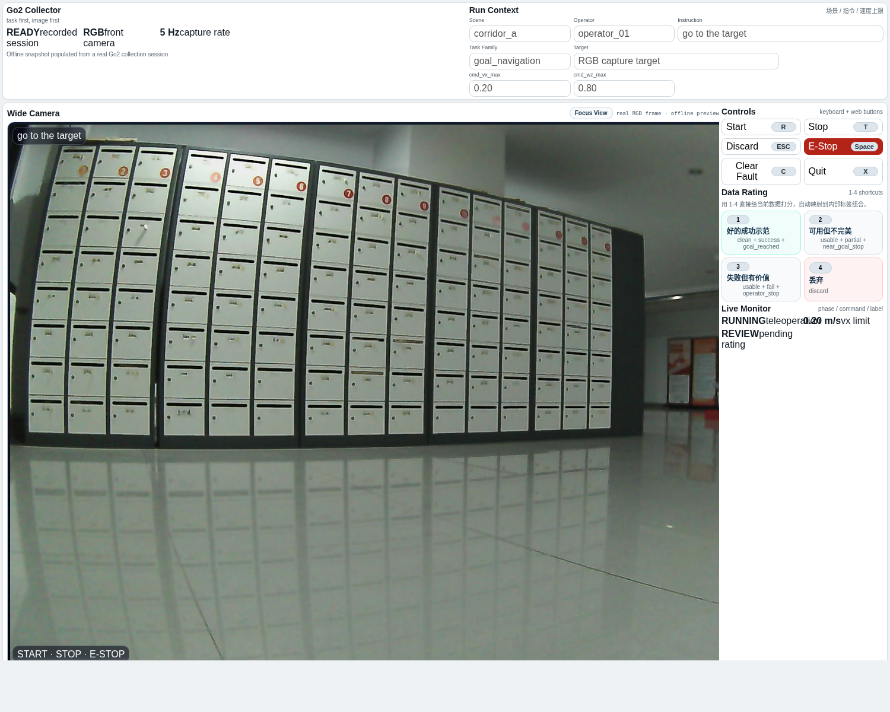
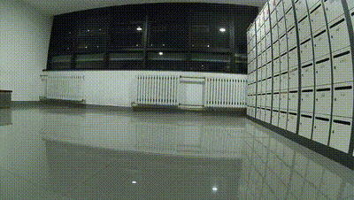
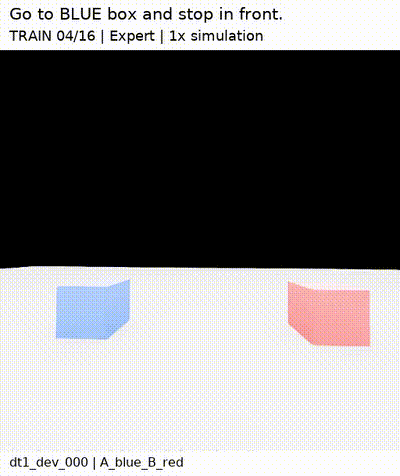
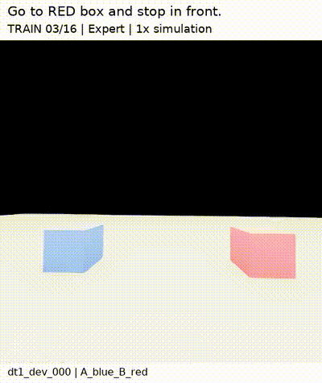
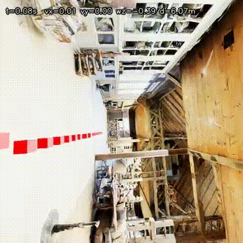

# Go2-SmolVLA-NaVILA

A unified vision-language navigation and high-level velocity-control framework for Unitree Go2. The repository brings simulation task generation, teleoperation collection, shared episode contracts, data review, SmolVLA action interfaces, R2R/NaVILA conversion, and LLaDA-V diffusion action decoding into one project.

## Highlights

- Isaac Sim task, scene, expert trajectory, and episode-recording interfaces
- Go2 state, velocity, safety, and teleoperation adapters
- One versioned schema across simulation, real-robot capture, and mock runs
- Deterministic two-box visual PoC (`python -m go2_nav.cli demo`)
- R2R-VLNCE/NaVILA history-frame loading and split-aware data tooling
- Action clipping, slew-rate limiting, terminal hysteresis, and stop modeling
- Study configuration for historical vision, state injection, legacy/continuous experts, and Flow Matching denoising steps
- SmolVLA and model/backend contracts

## Quickstart

```bash
PYTHONPATH=. python -m go2_nav.cli demo --output artifacts/two_box
PYTHONPATH=. python -m go2_nav.cli review --input artifacts/two_box/episodes.json --output artifacts/two_box/clean.json
PYTHONPATH=. python -m go2_nav.cli study --output artifacts/study.json
```

The demo runs entirely on CPU and writes generated PPM observations plus a versioned episode record. External Isaac Sim, Unitree, checkpoint, and dataset integrations are explicit adapters selected at runtime.

## Layout

`go2_nav/` portable contracts, mock runtime, quality review, and study CLI · `collectors/` simulation and robot collection · `deploy/` Go2 adapters · `src/`, `datasets/`, `evaluation/` navigation and evaluation code · `configs/`, `docs/`, `tests/` configuration, design notes, and checks.

## Design matrix

| Dimension | Configurable variants |
|---|---|
| Expert | legacy / continuous |
| Action | clipping / slew-rate / explicit stop |
| Context | current frame / historical frames |
| State | vision-language only / state injection |
| Diffusion | configurable Flow Matching denoising steps |
| Backbone | SmolVLA / LLaDA-V |

## Licensing

Project additions are Apache-2.0. Files imported from upstream projects retain their upstream licensing and notices in `licenses/` and `THIRD_PARTY_NOTICES.md`. Cite SmolVLA, NaVILA, LLaDA-V, SigLIP2, R2R/VLNCE, Matterport3D, Isaac Sim, and Unitree SDK when using corresponding components.

## Visual demonstrations

The gallery uses compact, source-labeled media from the Go2 collection platform and the current simulation workspace.

### Real Go2 data collection platform

<div align="center"></div>

The camera panel is filled with a real RGB frame from a repaired Go2 collection session. The first-person capture sequence is shown directly below.

<div align="center"></div>
<div align="center"><video controls muted loop width="680"><source src="media/real/go2_first_person_rgb_capture.mp4" type="video/mp4"></video></div>

### Dual-box instruction following · SmolVLA visual-language PoC

Four workspace rollouts cover both language targets and both target placements. Each preview keeps the instruction, target color, and placement variant visible together.

<table><tr>
<td align="center"><br><sub>“go to red” · red target A</sub></td>
<td align="center"><br><sub>“go to blue” · blue target A</sub></td>
<td align="center"><br><sub>“go to red” · red target B</sub></td>
<td align="center"><br><sub>“go to blue” · blue target B</sub></td>
</tr></table>

The four variants exercise language-conditioned target selection and visual target recognition through the same instruction → image → high-level velocity interface.

### NaVILA benchmark scene

<div align="center"></div>
<div align="center"><video controls muted loop width="680"><source src="media/simulation/navila_benchmark_moving_rollout.mp4" type="video/mp4"></video></div>

This moving qualitative reference trace is shown in the corrected camera orientation. It is included for scene and rollout inspection without claiming a benchmark score.

Run the deterministic local PoC with:

```bash
PYTHONPATH=. python -m go2_nav.cli demo --episodes 2 --output artifacts/two_box
```
