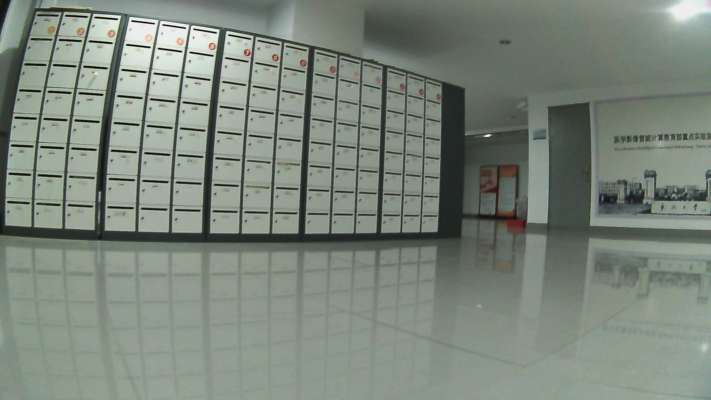
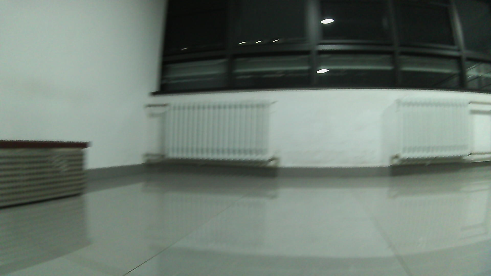
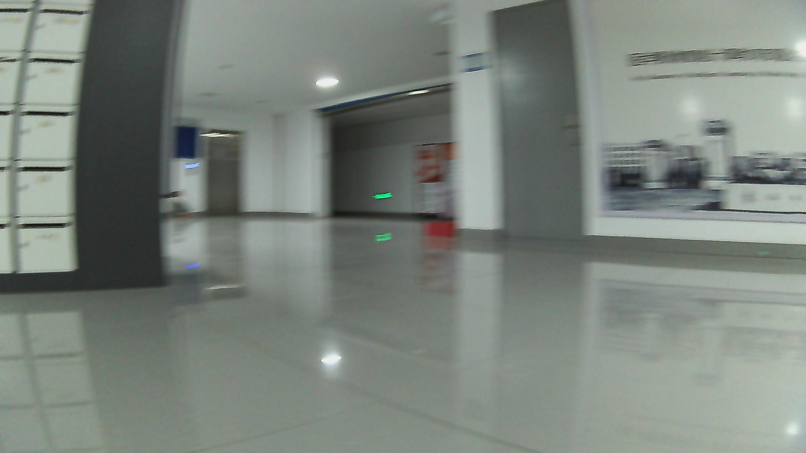

# Go2-SmolVLA-NaVILA

A unified vision-language navigation and high-level velocity-control framework for Unitree Go2. The repository brings simulation task generation, teleoperation collection, shared episode contracts, data review, SmolVLA action interfaces, R2R/NaVILA conversion, and LLaDA-V diffusion action decoding into one project.

## Highlights

- Isaac Sim task, scene, expert trajectory, and episode-recording interfaces
- Go2 state, velocity, safety, and teleoperation adapters
- One versioned schema across simulation, real-robot capture, and mock runs
- Deterministic two-box visual PoC (`python -m go2_nav.cli demo`)
- R2R-VLNCE/NaVILA history-frame loading and split-aware data tooling
- Action clipping, slew-rate limiting, terminal hysteresis, and stop modeling
- Study configuration for historical vision, state injection, legacy/continuous experts, and Flow Matching denoising steps
- SmolVLA and model/backend contracts

## Quickstart

```bash
PYTHONPATH=. python -m go2_nav.cli demo --output artifacts/two_box
PYTHONPATH=. python -m go2_nav.cli review --input artifacts/two_box/episodes.json --output artifacts/two_box/clean.json
PYTHONPATH=. python -m go2_nav.cli study --output artifacts/study.json
```

The demo runs entirely on CPU and writes generated PPM observations plus a versioned episode record. External Isaac Sim, Unitree, checkpoint, and dataset integrations are explicit adapters selected at runtime.

## Layout

`go2_nav/` portable contracts, mock runtime, quality review, and study CLI · `collectors/` simulation and robot collection · `deploy/` Go2 adapters · `src/`, `datasets/`, `evaluation/` navigation and evaluation code · `configs/`, `docs/`, `tests/` configuration, design notes, and checks.

## Design matrix

| Dimension | Configurable variants |
|---|---|
| Expert | legacy / continuous |
| Action | clipping / slew-rate / explicit stop |
| Context | current frame / historical frames |
| State | vision-language only / state injection |
| Diffusion | configurable Flow Matching denoising steps |
| Backbone | SmolVLA / LLaDA-V |

## Licensing

Project additions are Apache-2.0. Files imported from upstream projects retain their upstream licensing and notices in `licenses/` and `THIRD_PARTY_NOTICES.md`. Cite SmolVLA, NaVILA, LLaDA-V, SigLIP2, R2R/VLNCE, Matterport3D, Isaac Sim, and Unitree SDK when using corresponding components.

## Visual demonstrations

The repository includes source-backed demonstrations from the collection platform.

### Real Go2 collection platform

[Open the Go2 teleoperation console](media/ui/go2_teleop_console.html)

These sample frames are operator-collected real-session data. They show the sensor stream and collection platform, not a claimed successful autonomous navigation run.

| Real session sample | Preview |
|---|---|
| Episode 1 |  |
| Episode 2 |  |
| Episode 3 |  |

### Simulation and dual-box PoC

[Open the simulation dataset review](media/real/simulation_dataset_review.html)

These compact Isaac Sim clips are expert/collection traces: the dual-box-style expected-success rollout plus door and suitcase instruction examples. They are qualitative PoC assets, not measured model-success claims.

- [Dual-box expert rollout](media/simulation/two_box_expert_rollout.mp4)
- [Door instruction expert rollout](media/simulation/door_expert_rollout.mp4)
- [Suitcase instruction expert rollout](media/simulation/suitcase_expert_rollout.mp4)
- [Visual-language policy trace](media/simulation/visual_language_policy_trace.mp4)

The SmolVLA PoC path uses the same instruction → visual observation → high-level velocity action interface:

```bash
PYTHONPATH=. python -m go2_nav.cli demo --episodes 2 --output artifacts/two_box
```
